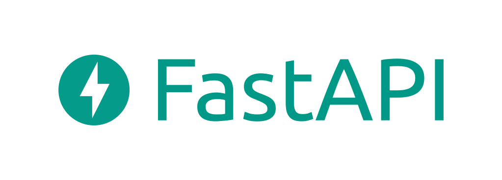
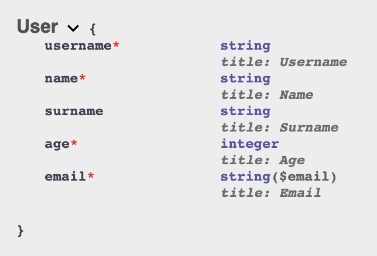

# FastApiMongoBoilerTemplate

## Run Project

- docker-compose build
- docker-compose up -d

## Fast api documentation

- http://0.0.0.0:8000/docs#/
- http://0.0.0.0:8000/redoc

## To run mongo locally

- docker pull mongo:latest
- sh docker_mongo_local_run.sh
- docker ps

## Schema

